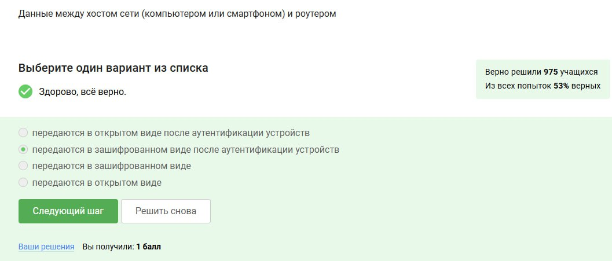

---
## Front matter
lang: ru-RU
title: Отчёт по Внешнему Курсу - Этап 1
subtitle: Основы информационной безопасности
author:
  - Чистов Д. М.
institute:
  - Российский университет дружбы народов, Москва, Россия
  - Объединённый институт ядерных исследований, Дубна, Россия
date: 17 мая 2025

## i18n babel
babel-lang: russian
babel-otherlangs: english

## Formatting pdf
toc: false
toc-title: Содержание
slide_level: 2
aspectratio: 169
section-titles: true
theme: metropolis
header-includes:
 - \metroset{progressbar=frametitle,sectionpage=progressbar,numbering=fraction}
---

# Цель работы

Пройти внешний курс - Этап 1

## Выполнение лабораторной работы

В лекционных материалах было сказано, что в протоколы прикладного уровня включён HTTPS.

{#fig:001 width=70%}

## Выполнение лабораторной работы

TCP работает на транспортном уровне, IP - на сетевом.

{#fig:002 width=70%}

## Выполнение лабораторной работы

Т.к. IPv4 - набор цифр от 0 до 255, следовательно исключаем варианты, которые содержат числа больше/меньше этого набора.

{#fig:003 width=70%}

## Выполнение лабораторной работы

DNS сопоставляет доменное имя соответствующий ему IP.

{#fig:004 width=70%}

## Выполнение лабораторной работы

Порядок такой.

{#fig:005 width=70%}

## Выполнение лабораторной работы

http - предоставляет в открытом виде, именно эту проблему решает https, он работает также, только в этот раз данные шифруются.

{#fig:006 width=70%}

## Выполнение лабораторной работы

Рукопожатие и передача данных, аутентификации не входит.

{#fig:007 width=70%}

## Выполнение лабораторной работы

Обязательно версия протокола определяется обоими.

{#fig:008 width=70%}

## Выполнение лабораторной работы

Шифрование данных не происходит в фазе рукопожатия, только после неё.

{#fig:009 width=70%}

## Выполнение лабораторной работы

Куки не хранят пароль пользователя или его IP адрес.

{#fig:010 width=70%}

## Выполнение лабораторной работы

Куки не сильно влияют на безопасность, скорее упрощают работу пользователям.

{#fig:011 width=70%}

## Выполнение лабораторной работы

Куки генерируются сервером и отправляются клиенту, а не наоборот.

{#fig:012 width=70%}

## Выполнение лабораторной работы

Сессионные куки исчезнут, как только мы закроем окно с веб-сайтом.

{#fig:013 width=70%}

## Выполнение лабораторной работы

3, т.к. больше узлов анонимности не прибавляют, а при меньших узлах теряется смысл всего алгоритма маршрутизации TOR.

{#fig:014 width=70%}

## Выполнение лабораторной работы

При шифровании так получается, что охранный узел и промежуточный узел не знают по итогу IP адрес получателя данных.

{#fig:015 width=70%}

## Выполнение лабораторной работы

Отправитель генерирует общий секретный ключ со всеми тремя узлами.

{#fig:016 width=70%}

## Выполнение лабораторной работы

Нет, не должен, далее возвращение данных происходит как обычно.

{#fig:017 width=70%}

## Выполнение лабораторной работы

У Wi-fi нет расшифроки, вообще это была такая пометка от компании, которая проверяла поддерживает ли устройство беспроводную сеть, а так это технология беспроводной сети.

{#fig:018 width=70%}

## Выполнение лабораторной работы

На канальном уровне, т.к. речь всё-таки идёт о физическом излучении и приёме сигнала.

{#fig:019 width=70%}

## Выполнение лабораторной работы

WEP самый первый, но и к сожалению, небезопасный, на данный момент самый безопасный - WPA3.

{#fig:020 width=70%}

## Выполнение лабораторной работы

На новых версиях беспроводных сетей происходит шифрование, но перед этим обязательно аутентификация.

{#fig:021 width=70%}

## Выполнение лабораторной работы

Для домашней сети - personal, для Корпоративных сетей используют Enterprise, т.к. есть база данных её пользователей. Это усиливает безопасность корпорации..

{#fig:022 width=70%}

# Выводы

Этап 1 пройден успешно на максимальный балл.

# Список литературы

[Курс "Основы Кибербезопасности" на платформе Stepik](https://stepik.org/course/111511)

