---
## Front matter
lang: ru-RU
title: Отчёт по Внешнему Курсу - Этап 2
subtitle: Основы информационной безопасности
author:
  - Чистов Д. М.
institute:
  - Российский университет дружбы народов, Москва, Россия
  - Объединённый институт ядерных исследований, Дубна, Россия
date: 17 мая 2025

## i18n babel
babel-lang: russian
babel-otherlangs: english

## Formatting pdf
toc: false
toc-title: Содержание
slide_level: 2
aspectratio: 169
section-titles: true
theme: metropolis
header-includes:
 - \metroset{progressbar=frametitle,sectionpage=progressbar,numbering=fraction}
---

# Цель работы

Пройти внешний курс - Этап 2

## Выполнение лабораторной работы

Да, можно, тогда перед самим запуском всей системы также потребуется ввести пароль.

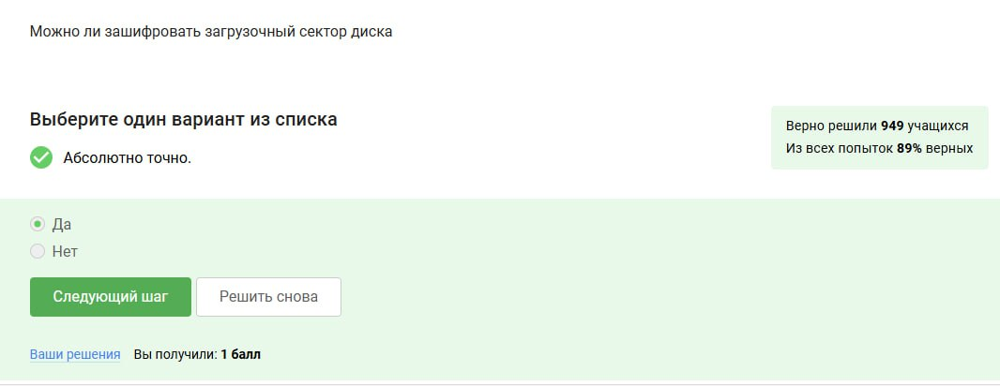{#fig:001 width=70%}

## Выполнение лабораторной работы

Шифрование основано на алгоритме AES.

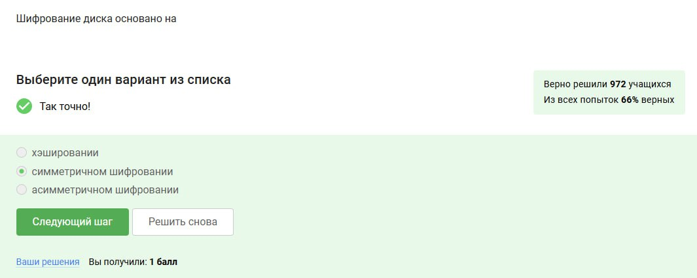{#fig:002 width=70%}

## Выполнение лабораторной работы

BitLocker - встроенный в Windows шифровщик, VeraCrypt - сторонняя утилита для шифрования данных.

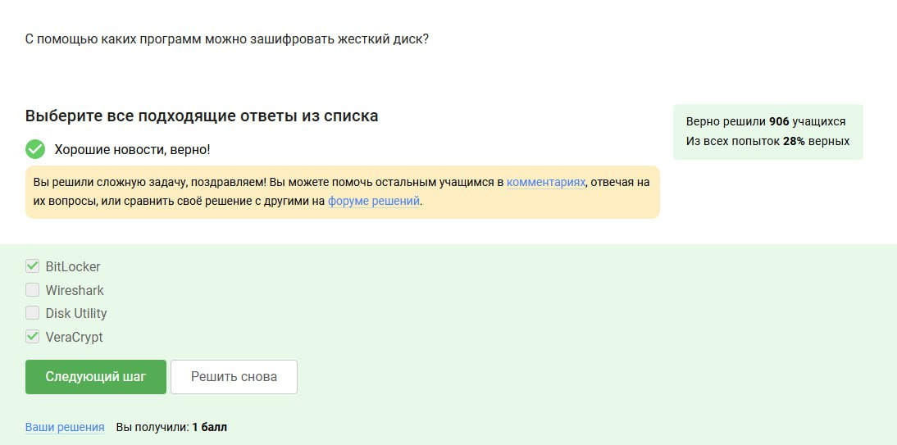{#fig:003 width=70%}

## Выполнение лабораторной работы

Потому что есть латинские буквы - заглавные и не заглавные, а также цифры и особые символы.

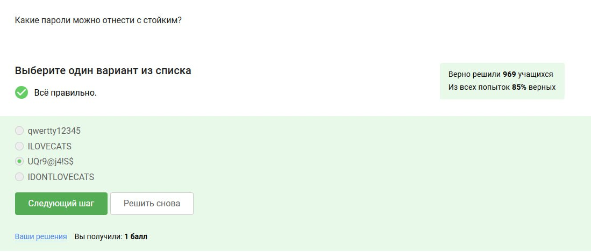{#fig:004 width=70%}

## Выполнение лабораторной работы

Безопаснее всего хранить в менеджерах паролей, но для такого менеджера желательно всё-таки придумать очень хороший пароль и вот его придётся запомнить самому.

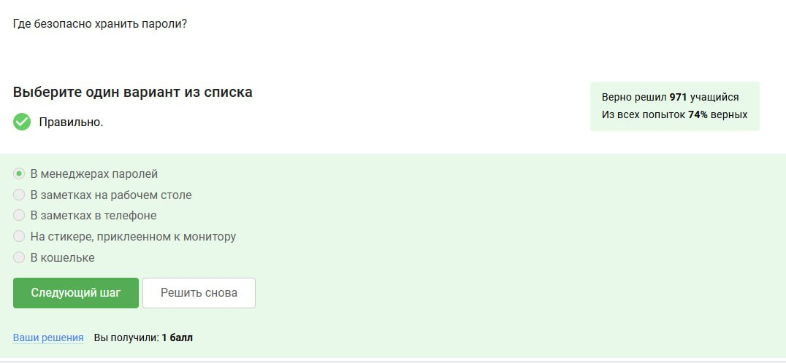{#fig:005 width=70%}

## Выполнение лабораторной работы

Капча спасает от автоматизированных атак, правда в последнее время искусственный интеллект иногда справляется с такой защитой, иногда злоумышленники специально платят людьми за решение капчи.

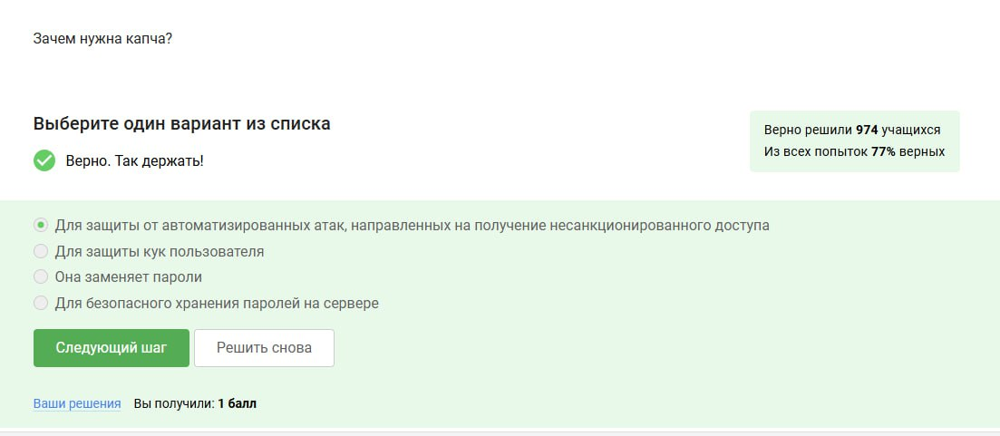{#fig:006 width=70%}

## Выполнение лабораторной работы

Делается это для того, чтобы не хранить пароли на сервере в открытом виде, ведь иногда злоумышленники могут устроить утечку данных, но хэширование не позволит злоумышленникам воспользоваться полученными данными, ведь их будет очень сложно расшифровать.

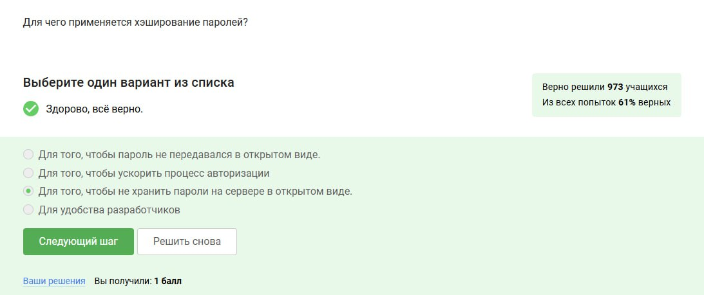{#fig:007 width=70%}

## Выполнение лабораторной работы

Нет, т.к. соль это тоже тип данных, который хранится на сервере, ну и если у злоумышленника есть доступ к серверу, значит и соль особо ему не поможет.

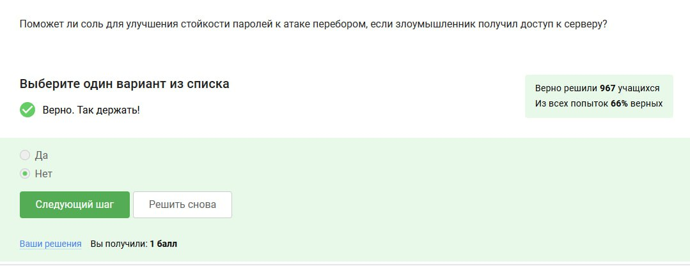{#fig:008 width=70%}

## Выполнение лабораторной работы

Здесь все варианты подходят, как те, которые зависят именно от пользователя, так и от владельца хранилища паролей (сервера).

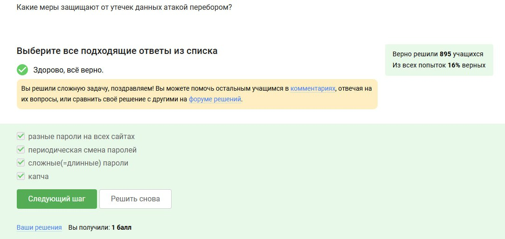{#fig:009 width=70%}

## Выполнение лабораторной работы

Первый вариант на первый взгляд содержит странные символы .br, однако это индикатор, что это страничка в Бразилии. Второй вариант действительно фишинговый, т.к. сделан на конструкторе сайтов wix.ru - сложно поверить, что такая крупная компания, как сбербанк делала бы свой сайт не самостоятельно с нуля. Третий, это просто рабочая ссылка Mail.ru, четвёртая - фишинговая, т.к. содержит подозрительные символы .ucoz.

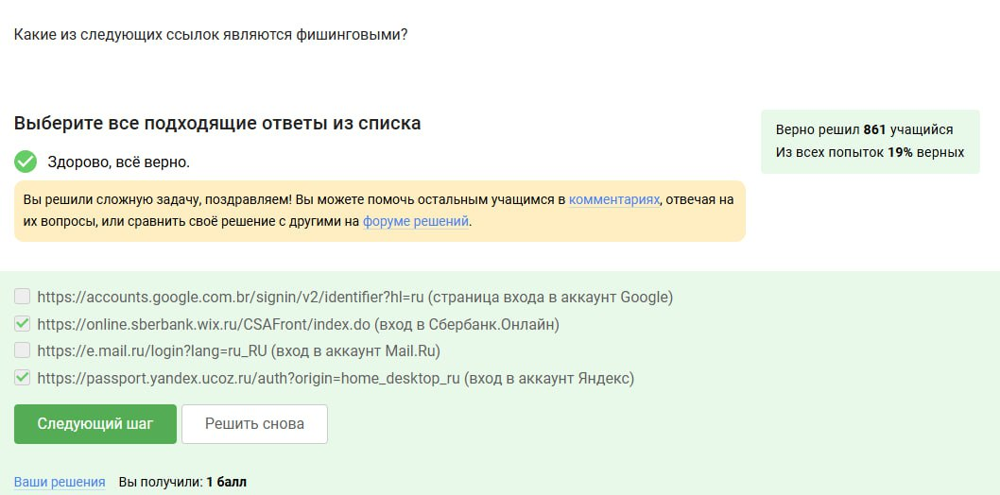{#fig:010 width=70%}

## Выполнение лабораторной работы

Может, например, если адрес взломали, или может вы спутаете его со знакомым вам адресом.

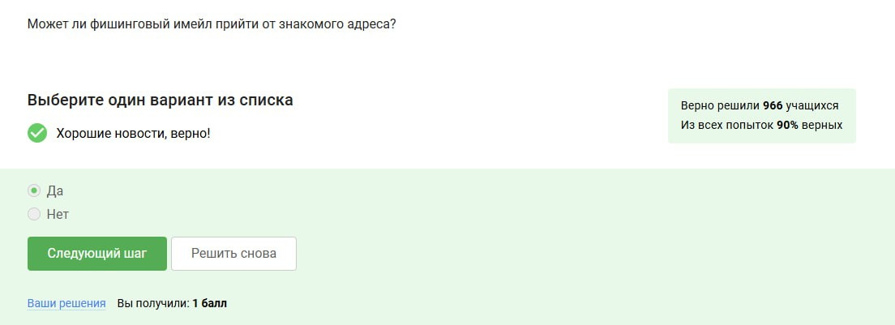{#fig:011 width=70%}

## Выполнение лабораторной работы

Это не протокол для отправки имейлов, но email спуфинга связан с проблемой старых протоколов для отправки имейлов.

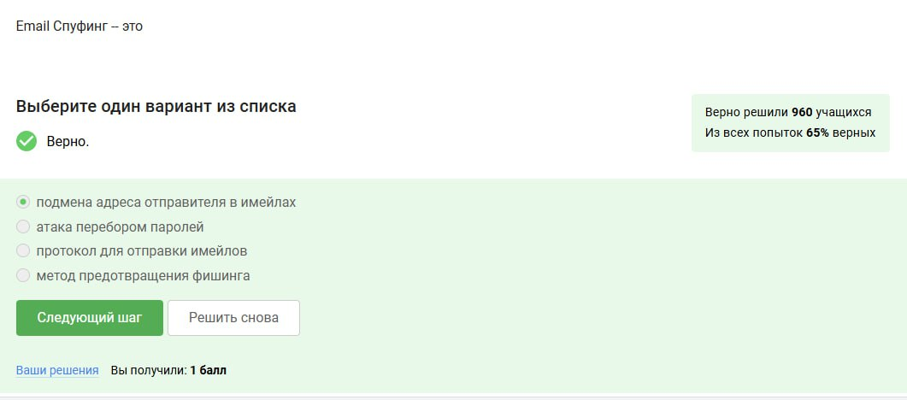{#fig:012 width=70%}

## Выполнение лабораторной работы

Оттого он и называется Троян.

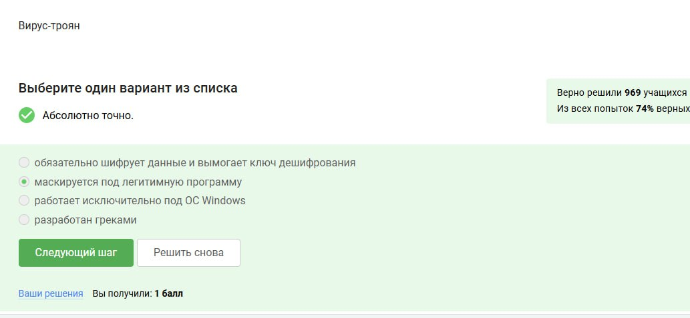{#fig:013 width=70%}

## Выполнение лабораторной работы

Это происходит только при самом первом сообщении между пользователями.

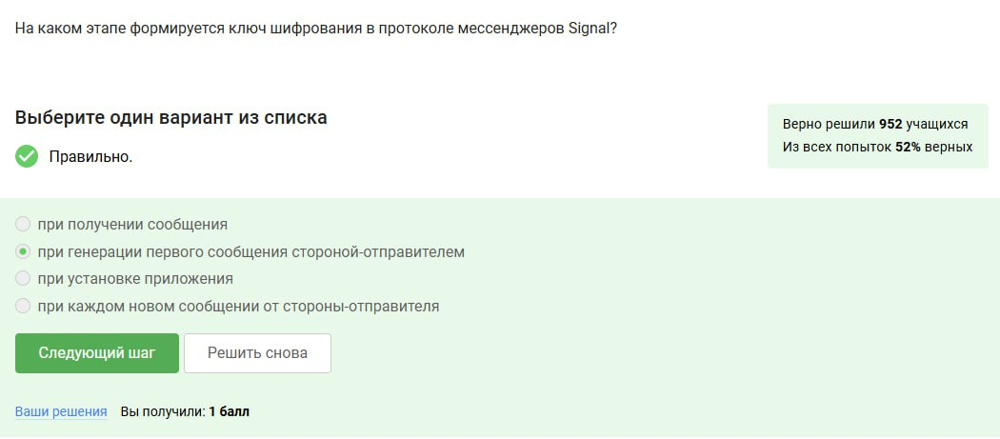{#fig:014 width=70%}

## Выполнение лабораторной работы

Сервер лишь знает, кому эти сообщения нужно передать, а сами сообщения он не понимает.

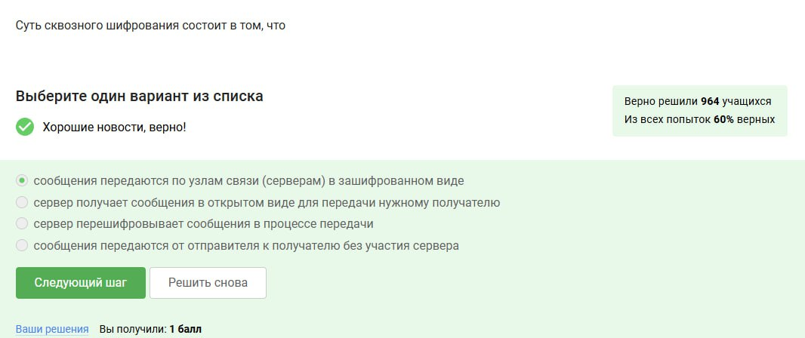{#fig:015 width=70%}

# Выводы

Этап 2 пройден успешно на максимальный балл.

# Список литературы

[Курс "Основы Кибербезопасности" на платформе Stepik](https://stepik.org/course/111511)

