---
## Front matter
title: "Отчёт по Внешнему Курсу - Этап 2"
subtitle: "Основы информационной безопасности"
author: "Чистов Даниил Максимович"

## Generic otions
lang: ru-RU
toc-title: "Содержание"

## Bibliography
bibliography: bib/cite.bib
csl: pandoc/csl/gost-r-7-0-5-2008-numeric.csl

## Pdf output format
toc: true # Table of contents
toc-depth: 1
lof: true # List of figures
lot: false # List of tables
fontsize: 11pt
linestretch: 1.5
papersize: a4
documentclass: scrreprt
## I18n polyglossia
polyglossia-lang:
  name: russian
  options:
	- spelling=modern
	- babelshorthands=true
polyglossia-otherlangs:
  name: english
## I18n babel
babel-lang: russian
babel-otherlangs: english
## Fonts
mainfont: IBM Plex Serif
romanfont: IBM Plex Serif
sansfont: IBM Plex Sans
monofont: IBM Plex Mono
mathfont: STIX Two Math
mainfontoptions: Ligatures=Common,Ligatures=TeX,Scale=0.94
romanfontoptions: Ligatures=Common,Ligatures=TeX,Scale=0.94
sansfontoptions: Ligatures=Common,Ligatures=TeX,Scale=MatchLowercase,Scale=0.94
monofontoptions: Scale=MatchLowercase,Scale=0.94,FakeStretch=0.9
mathfontoptions:
## Biblatex
biblatex: true
biblio-style: "gost-numeric"
biblatexoptions:
  - parentracker=true
  - backend=biber
  - hyperref=auto
  - language=auto
  - autolang=other*
  - citestyle=gost-numeric
## Pandoc-crossref LaTeX customization
figureTitle: "Рис."
tableTitle: "Таблица"
listingTitle: "Листинг"
lofTitle: "Список иллюстраций"
lotTitle: "Список таблиц"
lolTitle: "Листинги"
## Misc options
indent: true
header-includes:
  - \usepackage{indentfirst}
  - \usepackage{float} # keep figures where there are in the text
  - \floatplacement{figure}{H} # keep figures where there are in the text
---

# Цель работы

Пройти внешний курс - Этап 2

# Выполнение лабораторной работы

Да, можно, тогда перед самим запуском всей системы также потребуется ввести пароль (рис. [-@fig:001]).

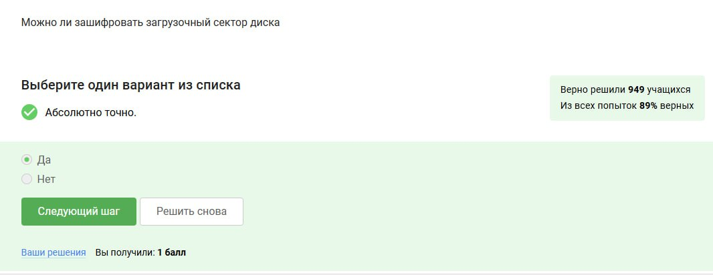{#fig:001 width=70%}

Шифрование основано на алгоритме AES (рис. [-@fig:002]).

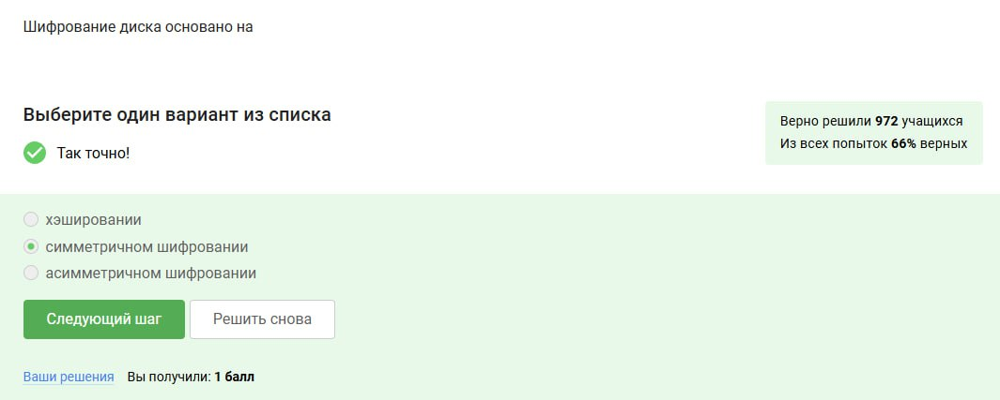{#fig:002 width=70%}

BitLocker - встроенный в Windows шифровщик, VeraCrypt - сторонняя утилита для шифрования данных (рис. [-@fig:003]).

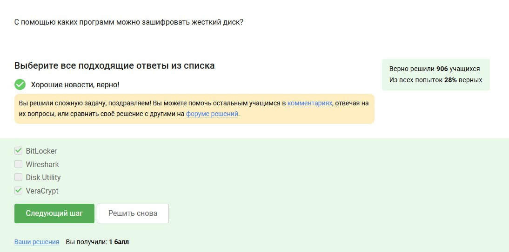{#fig:003 width=70%}

Потому что есть латинские буквы - заглавные и не заглавные, а также цифры и особые символы (рис. [-@fig:004]).

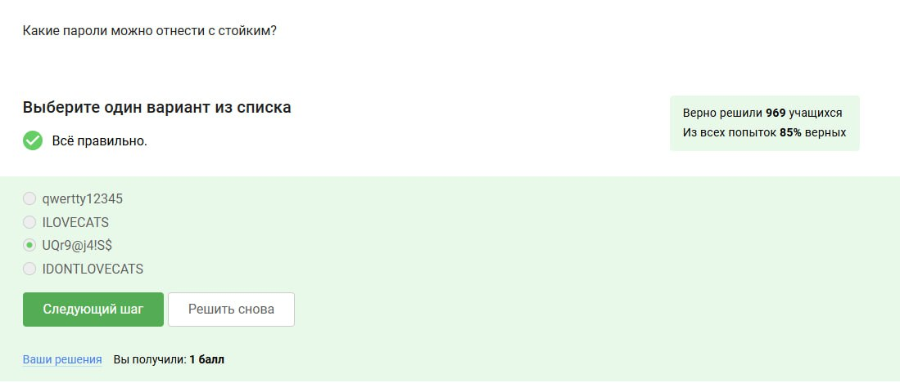{#fig:004 width=70%}

Безопаснее всего хранить в менеджерах паролей, но для такого менеджера желательно всё-таки придумать очень хороший пароль и вот его придётся запомнить самому (рис. [-@fig:005]).

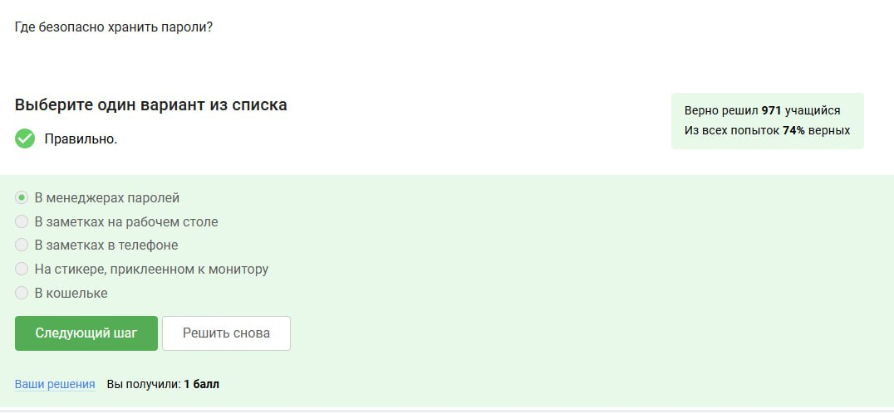{#fig:005 width=70%}

Капча спасает от автоматизированных атак, правда в последнее время искусственный интеллект иногда справляется с такой защитой, иногда злоумышленники специально платят людьми за решение капчи(рис. [-@fig:006]).

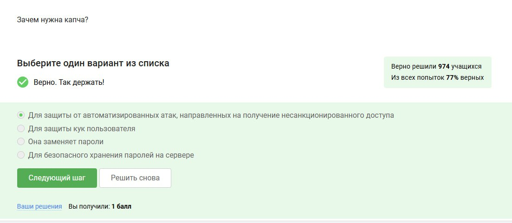{#fig:006 width=70%}

Делается это для того, чтобы не хранить пароли на сервере в открытом виде, ведь иногда злоумышленники могут устроить утечку данных, но хэширование не позволит злоумышленникам воспользоваться полученными данными, ведь их будет очень сложно расшифровать (рис. [-@fig:007]).

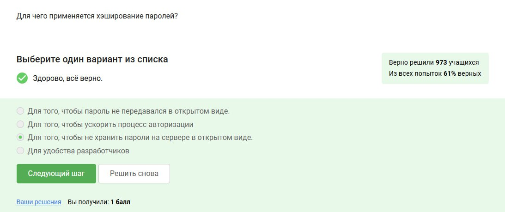{#fig:007 width=70%}

Нет, т.к. соль это тоже тип данных, который хранится на сервере, ну и если у злоумышленника есть доступ к серверу, значит и соль особо ему не поможет (рис. [-@fig:008]).

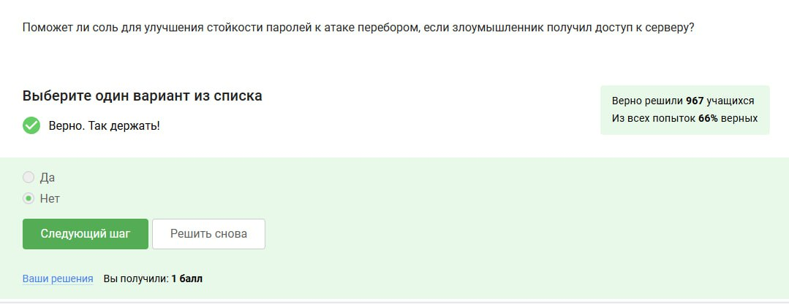{#fig:008 width=70%}

Здесь все варианты подходят, как те, которые зависят именно от пользователя, так и от владельца хранилища паролей (сервера) (рис. [-@fig:009]).

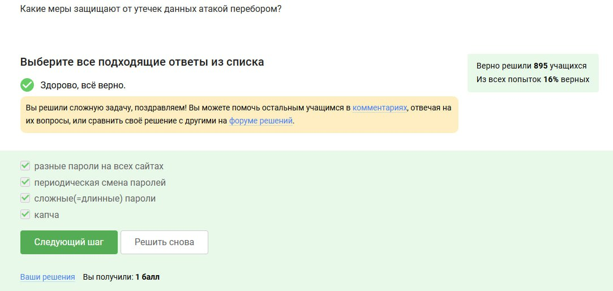{#fig:009 width=70%}

Первый вариант на первый взгляд содержит странные символы .br, однако это индикатор, что это страничка в Бразилии. Второй вариант действительно фишинговый, т.к. сделан на конструкторе сайтов wix.ru - сложно поверить, что такая крупная компания, как сбербанк делала бы свой сайт не самостоятельно с нуля. Третий, это просто рабочая ссылка Mail.ru, четвёртая - фишинговая, т.к. содержит подозрительные символы .ucoz (рис. [-@fig:010]).

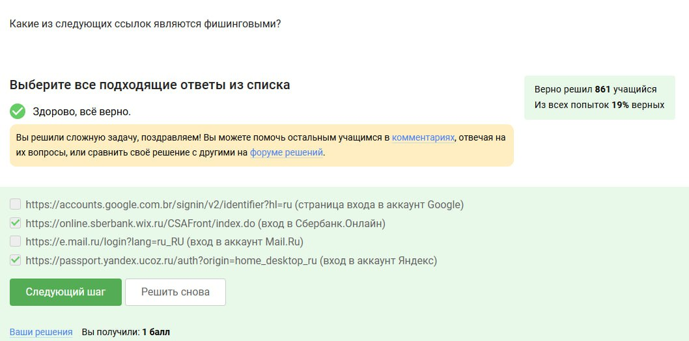{#fig:010 width=70%}

Может, например, если адрес взломали, или может вы спутаете его со знакомым вам адресом (рис. [-@fig:011]).

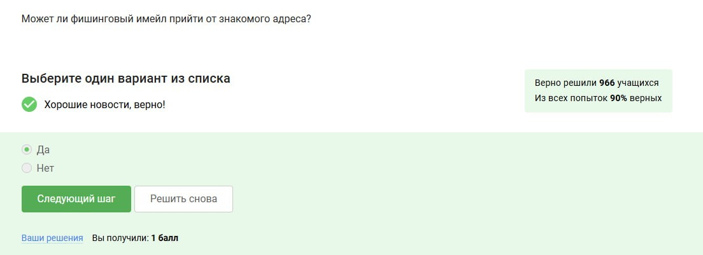{#fig:011 width=70%}

Это не протокол для отправки имейлов, но email спуфинга связан с проблемой старых протоколов для отправки имейлов (рис. [-@fig:012]).

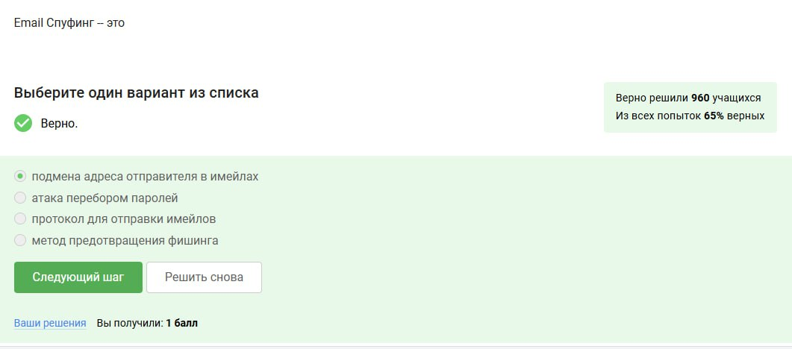{#fig:012 width=70%}

Оттого он и называется Троян (рис. [-@fig:013]).

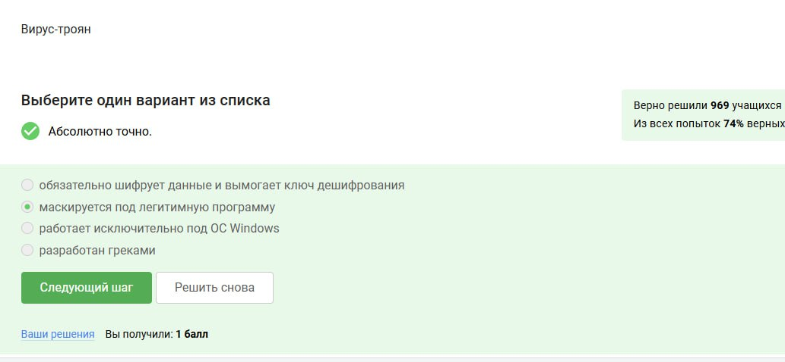{#fig:013 width=70%}

Это происходит только при самом первом сообщении между пользователями (рис. [-@fig:014]).

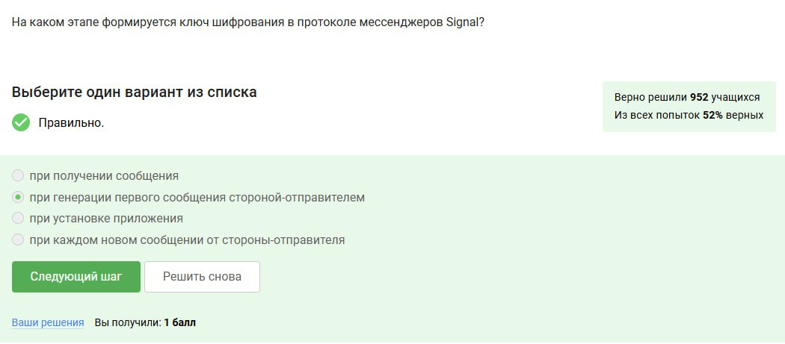{#fig:014 width=70%}

Сервер лишь знает, кому эти сообщения нужно передать, а сами сообщения он не понимает (рис. [-@fig:015]).

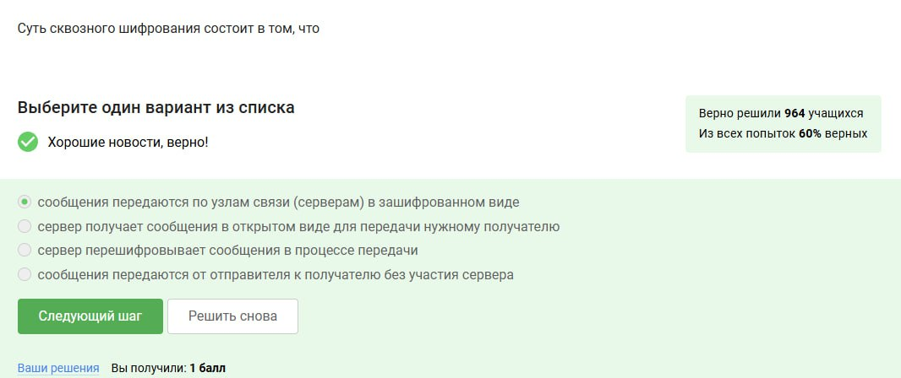{#fig:015 width=70%}

# Выводы

Этап 2 пройден успешно на максимальный балл.

# Список литературы

[Курс "Основы Кибербезопасности" на платформе Stepik](https://stepik.org/course/111511)

