---
## Front matter
lang: ru-RU
title: Отчёт по Внешнему Курсу - Этап 3
subtitle: Основы информационной безопасности
author:
  - Чистов Д. М.
institute:
  - Российский университет дружбы народов, Москва, Россия
  - Объединённый институт ядерных исследований, Дубна, Россия
date: 17 мая 2025

## i18n babel
babel-lang: russian
babel-otherlangs: english

## Formatting pdf
toc: false
toc-title: Содержание
slide_level: 2
aspectratio: 169
section-titles: true
theme: metropolis
header-includes:
 - \metroset{progressbar=frametitle,sectionpage=progressbar,numbering=fraction}
---

# Цель работы

Пройти внешний курс - Этап 3

## Выполнение лабораторной работы

В лекционных материалах было сказано, что в протоколы прикладного уровня включён HTTPS

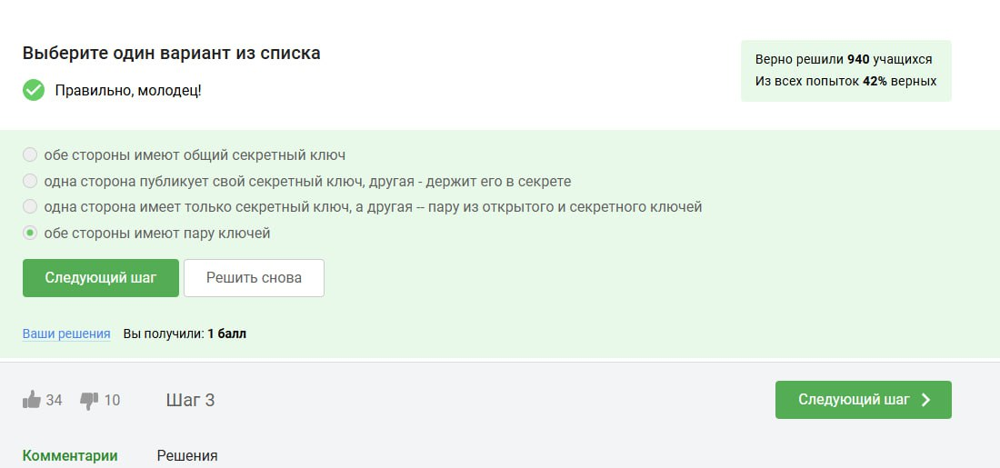{#fig:001 width=70%}

## Выполнение лабораторной работы

Обе стороны имеют публичный ключ и секретный ключ, одна сторона открывает публичный ключ, а другая использует его для шифрования, но только владелец секретного ключа его расшифровывает

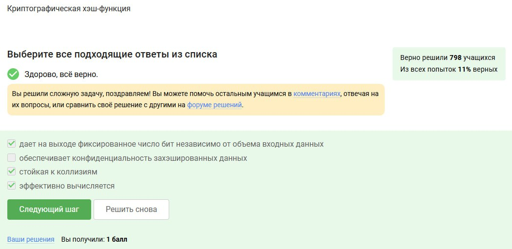{#fig:002 width=70%}

## Выполнение лабораторной работы

Всё подходит, но очевидно, что хэш-функция не обеспечивает конфиденциальность

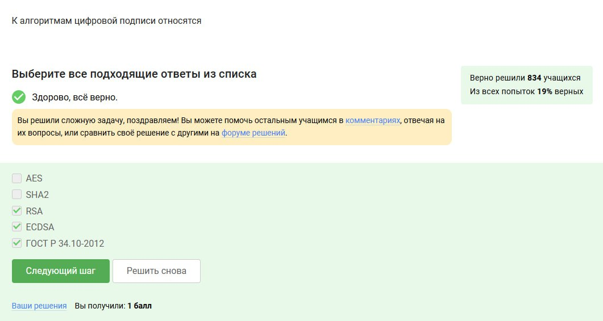{#fig:003 width=70%}

## Выполнение лабораторной работы

Первые два ответа - никак не относятся к цифровой подписи, это алгоритм симметричного шифрования (AES) и хэш-функция

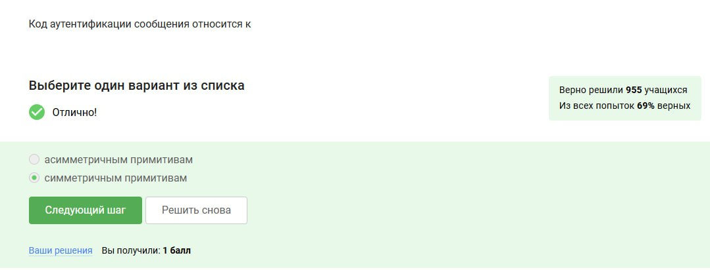{#fig:004 width=70%}

## Выполнение лабораторной работы

Т.к. обе стороны по сути проверяются по одному ключу, следовательно это симметричная криптография

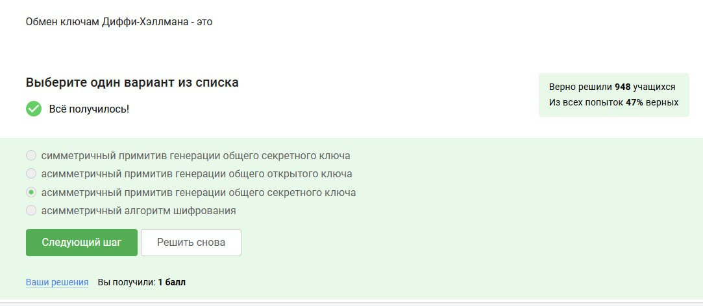{#fig:005 width=70%}

## Выполнение лабораторной работы

Асимметричный, т.к. у каждой стороны и свой секретная и открытая часть, и он устанавливает ключ, но не шифрует

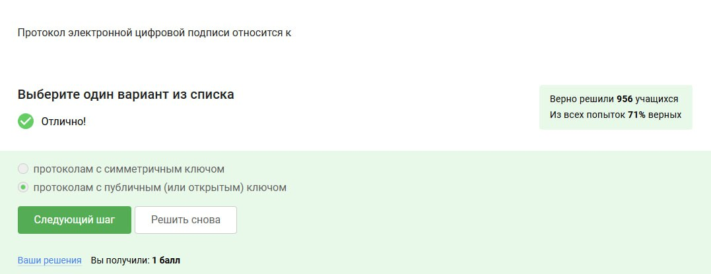{#fig:006 width=70%}

## Выполнение лабораторной работы

Т.к. для подписей используется асимметричная криптография, следовательно это публичный протокол

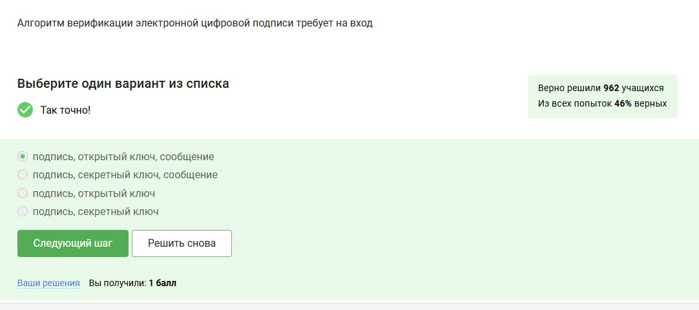{#fig:007 width=70%}

## Выполнение лабораторной работы

Открытый ключ используется для расшифровки подписи, подпись это зашифрованный хэш, ну и сам хэш

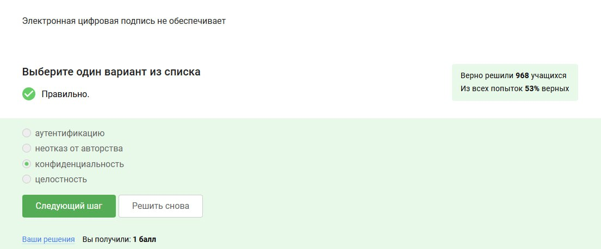{#fig:008 width=70%}

## Выполнение лабораторной работы

Конфиденциальность не обеспечивается, т.к. сообщение не шифруется

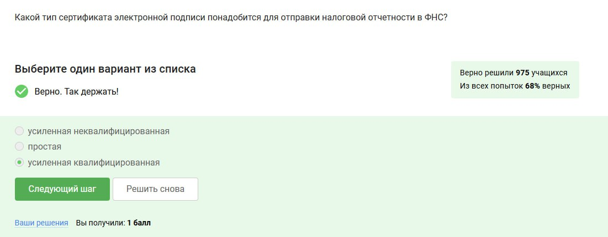{#fig:009 width=70%}

## Выполнение лабораторной работы

Она создаётся с использование сертифицированных средств криптозащиты, а также имеет юридическую силу, что важно при работе с государством

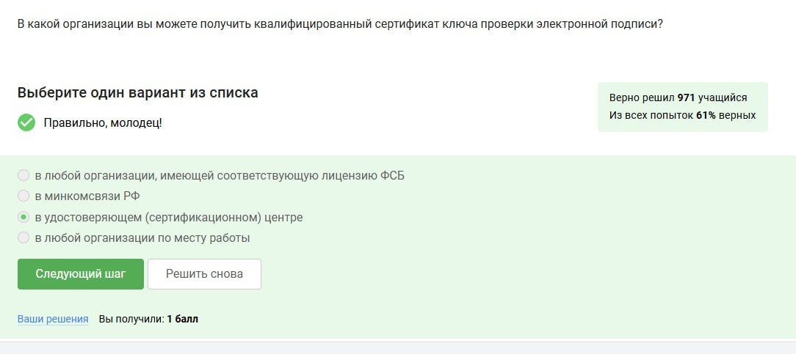{#fig:010 width=70%}

## Выполнение лабораторной работы

Такие центры именно для этого и созданы, когда речь идёт о безопасности - это наилучший вариант, чем позволять выдавать сертификаты каждой желающей организации

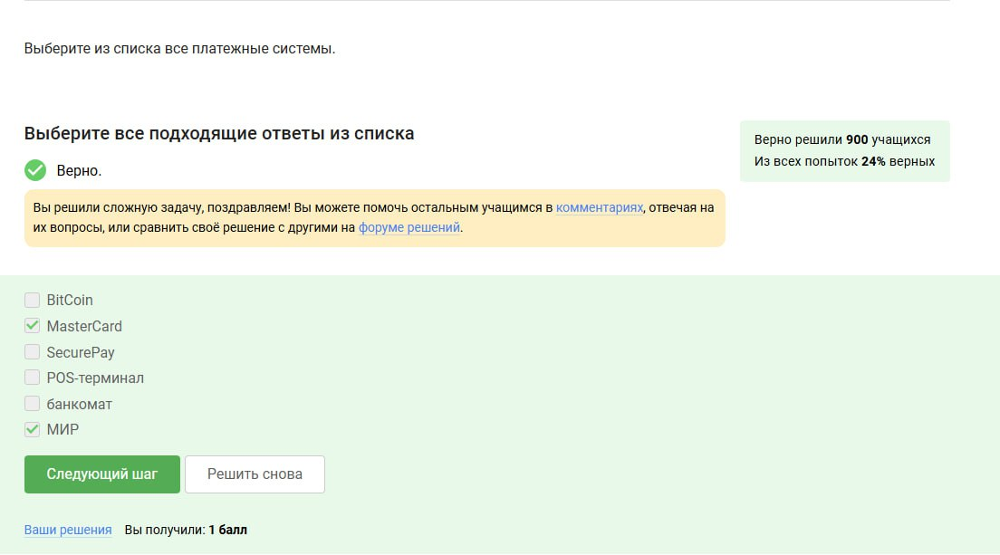{#fig:011 width=70%}

## Выполнение лабораторной работы

SecurePay не считается, т.к. это электронная платёжная система, по сути и Bitcoin по этому не считается

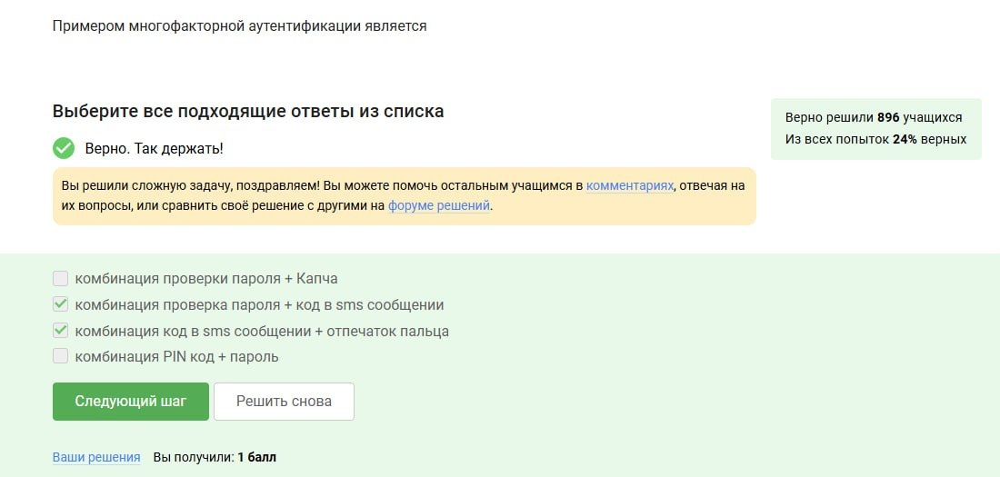{#fig:012 width=70%}

## Выполнение лабораторной работы

Капча лишь может предотвратить (и то не всегда) автоматизированную атаку, а PIN-код + пароль тоже можно подобрать и не нужно иметь доступ к чему-нибудь стороннему (например, телефону)

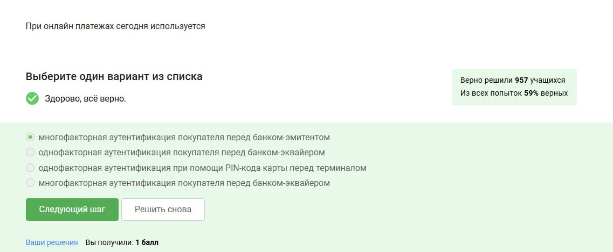{#fig:013 width=70%}

## Выполнение лабораторной работы

Банк-эмитент - тот, кто выпустил карту, следовательно он несёт ответственность за аутентификацию пользователя, также используется многофакторная аутентификация - что-то, что знает пользователь + что-то, что этот пользователь имеет (телефон)

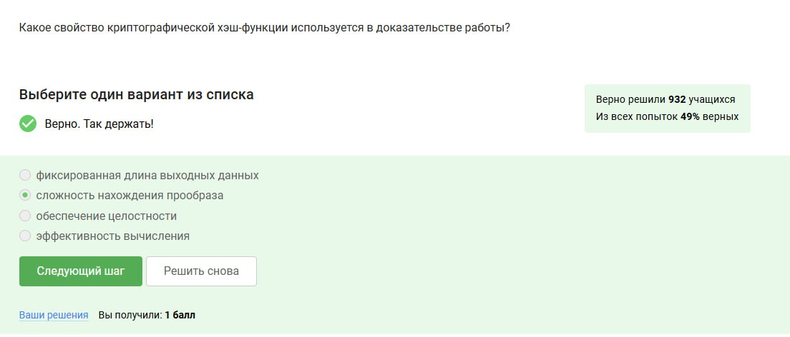{#fig:014 width=70%}

## Выполнение лабораторной работы

При нахождении потребуется очень много вычислений, переборов - оттого и сложность, однако проверка результата будет быстрой

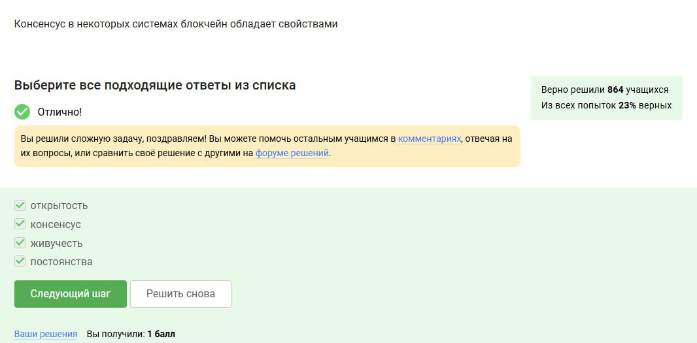{#fig:015 width=70%}

## Выполнение лабораторной работы

Подходят все варианты

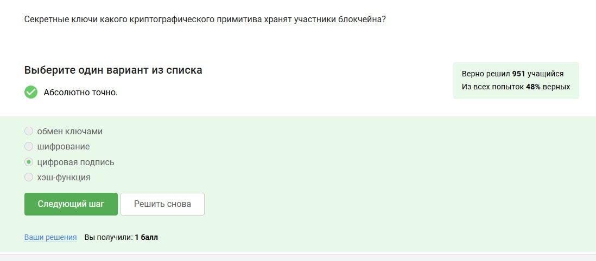{#fig:016 width=70%}

## Выполнение лабораторной работы

Курс успешно пройден

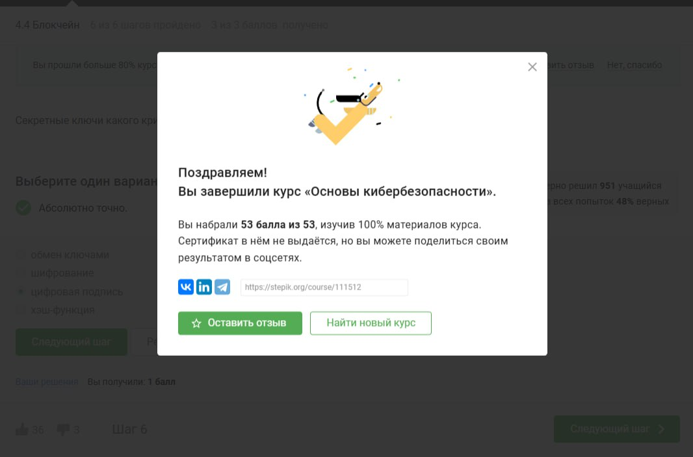{#fig:017 width=70%}

# Выводы

Этап 3 пройден успешно на максимальный балл.

# Список литературы

[Курс "Основы Кибербезопасности" на платформе Stepik](https://stepik.org/course/111511)
