---
## Front matter
title: "Отчёт по Внешнему Курсу - Этап 1"
subtitle: "Основы информационной безопасности"
author: "Чистов Даниил Максимович"

## Generic otions
lang: ru-RU
toc-title: "Содержание"

## Bibliography
bibliography: bib/cite.bib
csl: pandoc/csl/gost-r-7-0-5-2008-numeric.csl

## Pdf output format
toc: true # Table of contents
toc-depth: 1
lof: true # List of figures
lot: false # List of tables
fontsize: 11pt
linestretch: 1.5
papersize: a4
documentclass: scrreprt
## I18n polyglossia
polyglossia-lang:
  name: russian
  options:
	- spelling=modern
	- babelshorthands=true
polyglossia-otherlangs:
  name: english
## I18n babel
babel-lang: russian
babel-otherlangs: english
## Fonts
mainfont: IBM Plex Serif
romanfont: IBM Plex Serif
sansfont: IBM Plex Sans
monofont: IBM Plex Mono
mathfont: STIX Two Math
mainfontoptions: Ligatures=Common,Ligatures=TeX,Scale=0.94
romanfontoptions: Ligatures=Common,Ligatures=TeX,Scale=0.94
sansfontoptions: Ligatures=Common,Ligatures=TeX,Scale=MatchLowercase,Scale=0.94
monofontoptions: Scale=MatchLowercase,Scale=0.94,FakeStretch=0.9
mathfontoptions:
## Biblatex
biblatex: true
biblio-style: "gost-numeric"
biblatexoptions:
  - parentracker=true
  - backend=biber
  - hyperref=auto
  - language=auto
  - autolang=other*
  - citestyle=gost-numeric
## Pandoc-crossref LaTeX customization
figureTitle: "Рис."
tableTitle: "Таблица"
listingTitle: "Листинг"
lofTitle: "Список иллюстраций"
lotTitle: "Список таблиц"
lolTitle: "Листинги"
## Misc options
indent: true
header-includes:
  - \usepackage{indentfirst}
  - \usepackage{float} # keep figures where there are in the text
  - \floatplacement{figure}{H} # keep figures where there are in the text
---

# Цель работы

Пройти внешний курс - Этап 1

# Выполнение лабораторной работы

В лекционных материалах было сказано, что в протоколы прикладного уровня включён HTTPS (рис. [-@fig:001]).

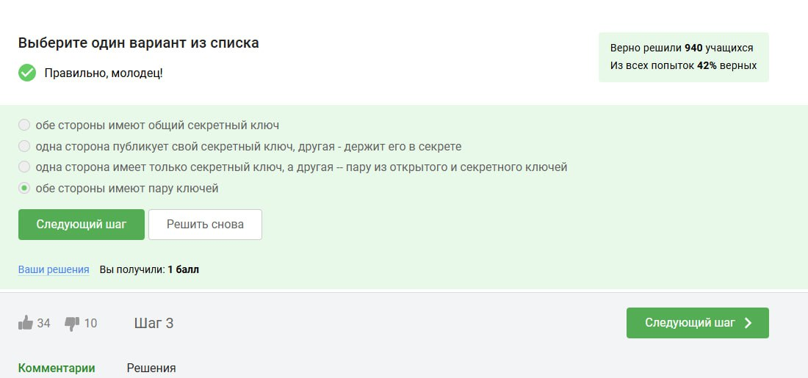{#fig:001 width=70%}

TCP работает на транспортном уровне, IP - на сетевом (рис. [-@fig:002]).

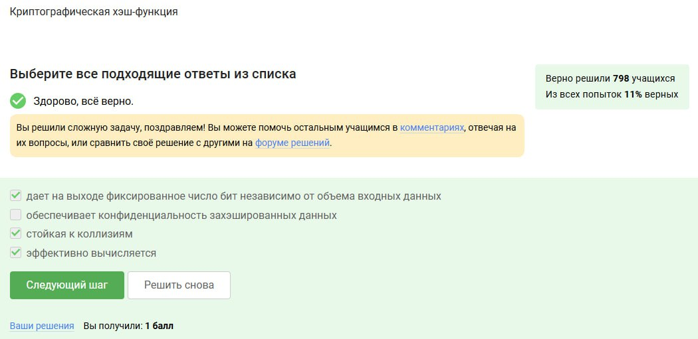{#fig:002 width=70%}

Т.к. IPv4 - набор цифр от 0 до 255, следовательно исключаем варианты, которые содержат числа больше/меньше этого набора (рис. [-@fig:003]).

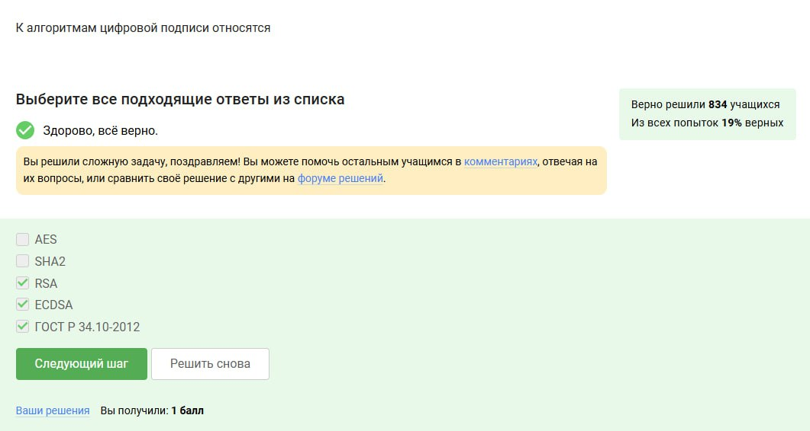{#fig:003 width=70%}

DNS сопоставляет доменное имя соответствующий ему IP (рис. [-@fig:004]).

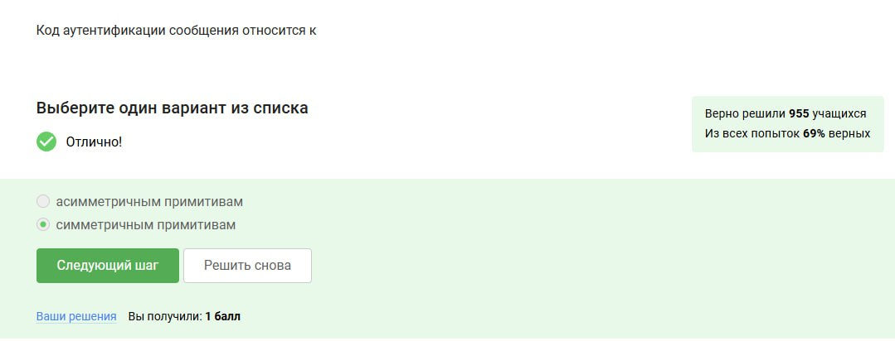{#fig:004 width=70%}

Порядок такой (рис. [-@fig:005]).

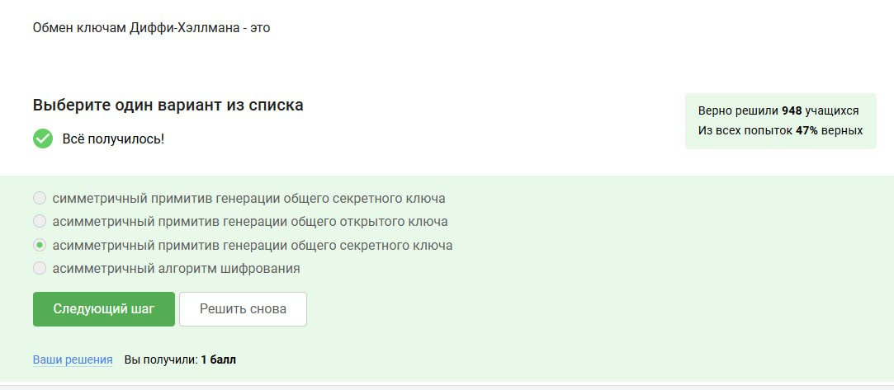{#fig:005 width=70%}

http - предоставляет в открытом виде, именно эту проблему решает https, он работает также, только в этот раз данные шифруются (рис. [-@fig:006]).

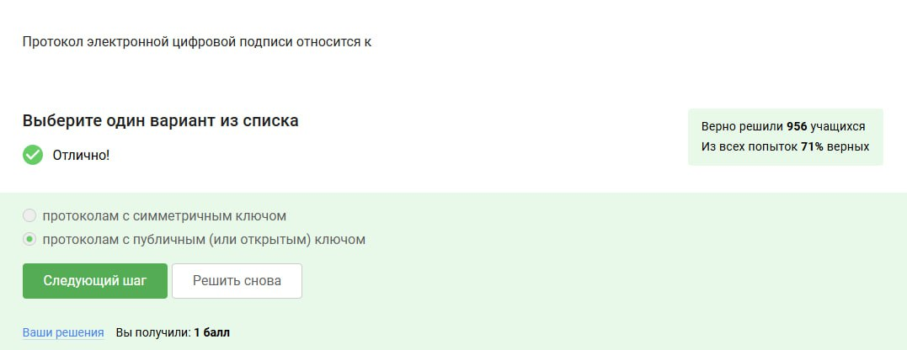{#fig:006 width=70%}

Рукопожатие и передача данных, аутентификации не входит (рис. [-@fig:007]).

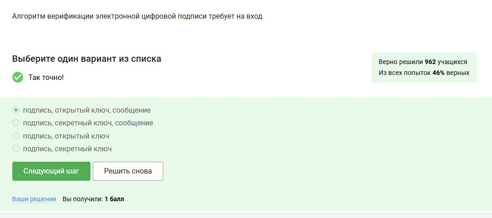{#fig:007 width=70%}

Обязательно версия протокола определяется обоими (рис. [-@fig:008]).

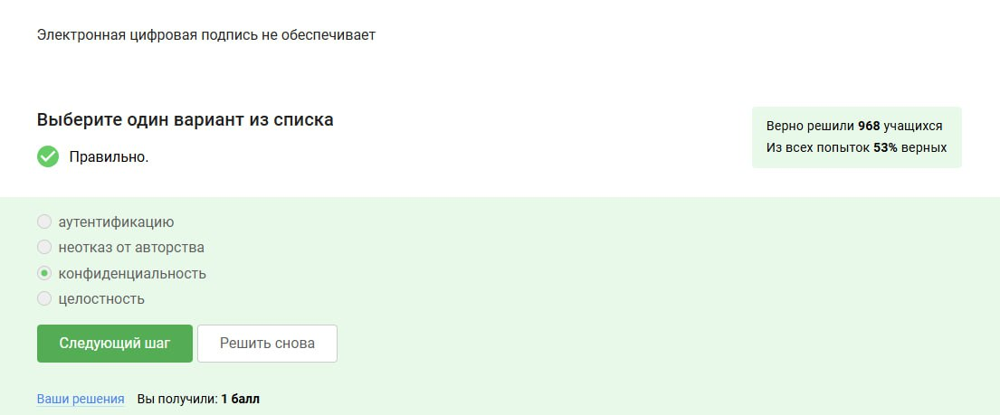{#fig:008 width=70%}

Шифрование данных не происходит в фазе рукопожатия, только после неё (рис. [-@fig:009]).

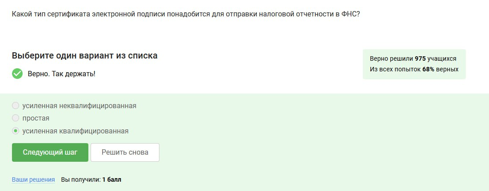{#fig:009 width=70%}

Куки не хранят пароль пользователя или его IP адрес (рис. [-@fig:010]).

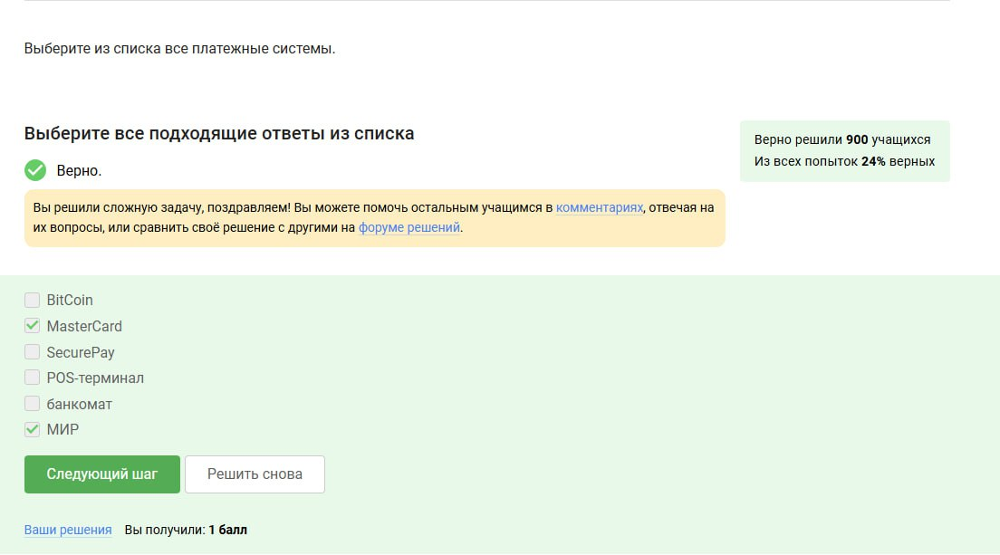{#fig:010 width=70%}

Куки не сильно влияют на безопасность, скорее упрощают работу пользователям (рис. [-@fig:011]).

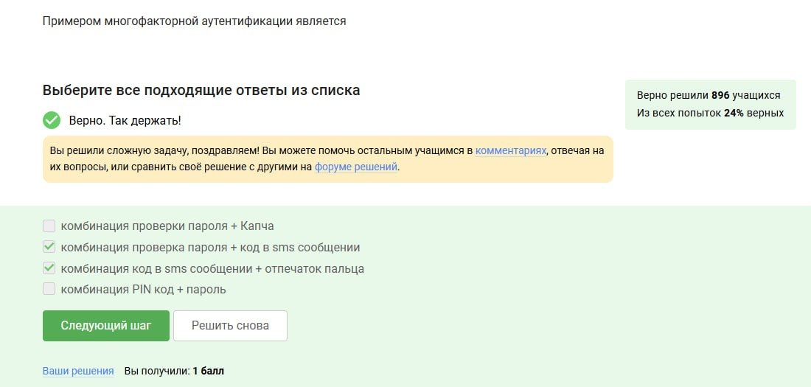{#fig:011 width=70%}

Куки генерируются сервером и отправляются клиенту, а не наоборот (рис. [-@fig:012]).

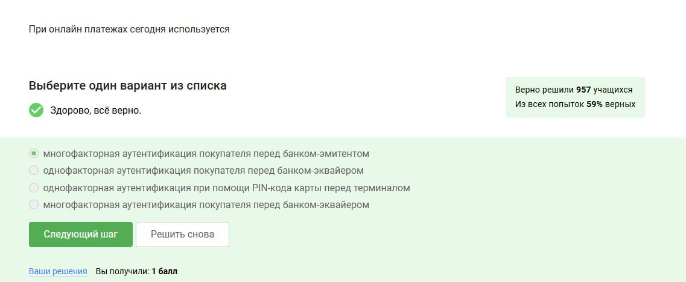{#fig:012 width=70%}

Сессионные куки исчезнут, как только мы закроем окно с веб-сайтом (рис. [-@fig:013]).

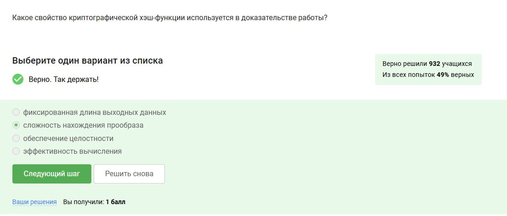{#fig:013 width=70%}

3, т.к. больше узлов анонимности не прибавляют, а при меньших узлах теряется смысл всего алгоритма маршрутизации TOR (рис. [-@fig:014]).

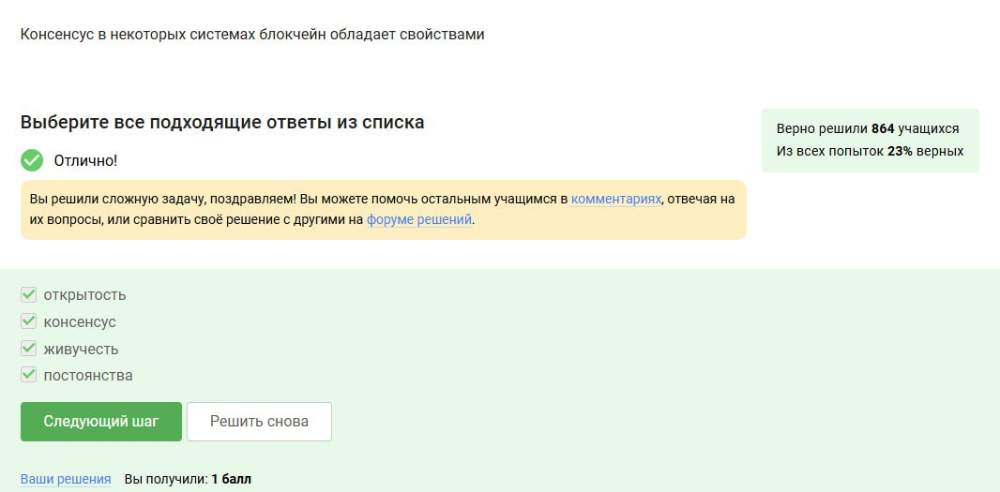{#fig:014 width=70%}

При шифровании так получается, что охранный узел и промежуточный узел не знают по итогу IP адрес получателя данных (рис. [-@fig:015]).

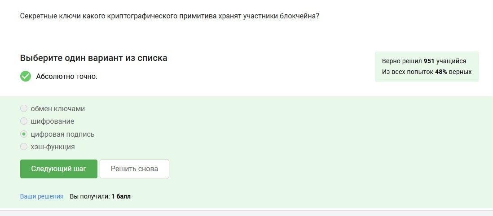{#fig:015 width=70%}

Отправитель генерирует общий секретный ключ со всеми тремя узлами (рис. [-@fig:016]).

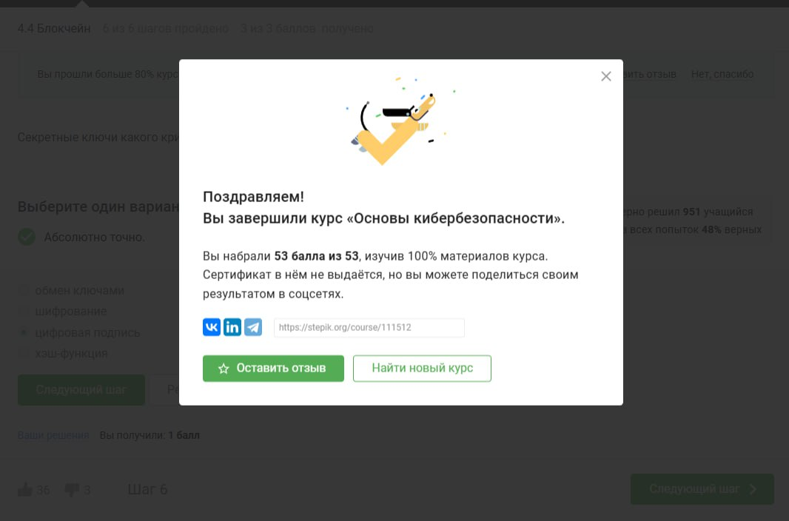{#fig:016 width=70%}

Нет, не должен, далее возвращение данных происходит как обычно (рис. [-@fig:017]).

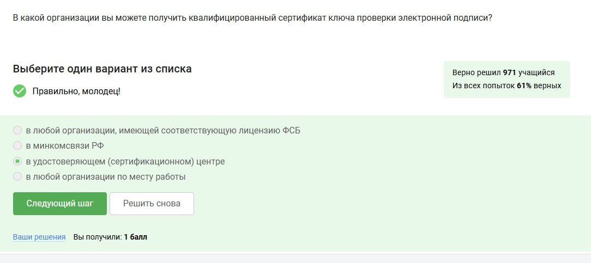{#fig:017 width=70%}

У Wi-fi нет расшифроки, вообще это была такая пометка от компании, которая проверяла поддерживает ли устройство беспроводную сеть, а так это технология беспроводной сети (рис. [-@fig:018]).

{#fig:018 width=70%}

На канальном уровне, т.к. речь всё-таки идёт о физическом излучении и приёме сигнала (рис. [-@fig:019]).

{#fig:019 width=70%}

WEP самый первый, но и к сожалению, небезопасный, на данный момент самый безопасный - WPA3 (рис. [-@fig:020]).

{#fig:020 width=70%}

На новых версиях беспроводных сетей происходит шифрование, но перед этим обязательно аутентификация (рис. [-@fig:021]).

{#fig:021 width=70%}

Для домашней сети - personal, для Корпоративных сетей используют Enterprise, т.к. есть база данных её пользователей. Это усиливает безопасность корпорации. (рис. [-@fig:022]).

{#fig:022 width=70%}

# Выводы

Этап 1 пройден успешно на максимальный балл.

# Список литературы

[Курс "Основы Кибербезопасности" на платформе Stepik](https://stepik.org/course/111511)

